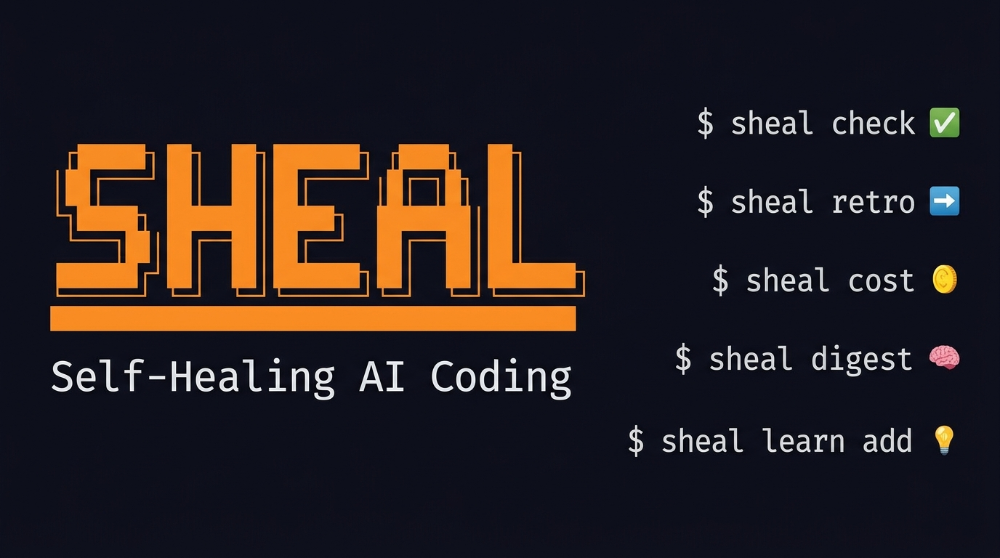
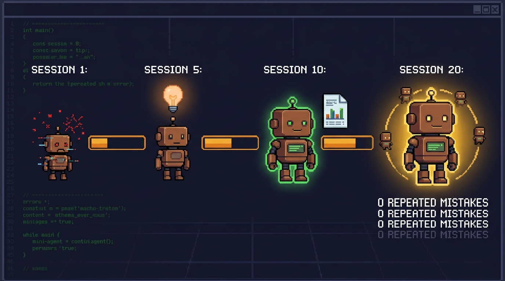

<p align="center">
  
</p>

<h1 align="center">sheal</h1>

<p align="center"><b>your ai agent keeps making the same mistakes. sheal fixes that.</b></p>

<p align="center">
  <a href="https://github.com/liwala/sheal/stargazers"></a>
  <a href="https://github.com/liwala/sheal/commits/main"></a>
  <a href="LICENSE"></a>
</p>

<p align="center">
  <a href="#install">Install</a> &bull;
  <a href="#quick-start">Quick Start</a> &bull;
  <a href="#commands">Commands</a> &bull;
  <a href="#how-it-works">How It Works</a> &bull;
  <a href="#supported-agents">Agents</a>
</p>

---

<p align="center">
  
</p>

A CLI toolkit that analyzes AI coding sessions to extract learnings, detect failure patterns, and continuously improve agent behavior.

Your AI agent has amnesia. Every session it repeats the same mistakes, burns the same tokens, forgets the same rules. **sheal** closes the loop — it reads your sessions, extracts the patterns, writes rules back to your agent config, and makes the next session smarter. It compounds.

<p align="center">
  
</p>

## Install

```bash
git clone https://github.com/liwala/sheal
cd sheal
npm install
npx tsc
npm link
```

## Quick Start

```bash
# Health check your project setup
sheal check

# Run a retrospective on your latest session
sheal retro

# See your token spend per project
sheal cost

# Get a categorized digest of what you worked on
sheal digest --since "7 days"

# Ask a question across all your sessions
sheal ask "what went wrong with beads?" --agent claude

# Add a learning from experience
sheal learn add "Always inspect real data before writing parsers" --tags=parsing
```

## Commands

### `sheal check`

Pre-session health check. Detects environment issues before you start coding.

```bash
sheal check                    # Pretty output
sheal check --format json      # JSON output
sheal check --skip performance # Skip specific checkers
```

**Checkers:** git status, dependencies, tests, environment, session learnings, performance & efficiency.

The performance checker detects your AI agent (Claude Code, Cursor, Gemini, Copilot, Amp), checks for RTK token compression, MCP servers, LSP tools, and config file sizes.

### `sheal retro`

Session retrospective. Analyzes the most recent AI coding session for failure loops, wasted effort, and learnings.

```bash
sheal retro                        # Static analysis (latest session)
sheal retro --checkpoint <id>      # Specific session
sheal retro --enrich               # LLM-enriched deep analysis
sheal retro --enrich --agent amp   # Use a specific agent CLI
sheal retro --prompt               # Output raw prompt (pipe to any LLM)
sheal retro --format json          # JSON output
```

The `--enrich` flag invokes an agent CLI to perform deep analysis on top of the static retro. The agent extracts rules and offers to save them as learnings. Results are cached at `.sheal/retros/`.

### `sheal ask <question>`

Query across your session transcripts using natural language. Uses a 3-phase pipeline:

1. **Extract search terms** from your question (agent-assisted, with local fallback)
2. **Local grep** across sessions using those terms (word-boundary matching)
3. **Agent analyzes** relevant excerpts to answer your question (falls back to raw excerpts)

```bash
# Search current project's sessions
sheal ask "what went wrong with beads?"

# Use a specific agent for analysis
sheal ask "how did we handle the auth migration?" --agent codex

# Search ALL projects globally
sheal ask --global "what patterns keep causing test failures?"

# Search a different project
sheal ask -p /path/to/other-project "what happened with the auth migration?"

# Search more sessions
sheal ask "show me all test failures" -n 20
```

Options:
- `--agent <name>` — Agent CLI to use: `claude`, `gemini`, `codex`, `amp`
- `-n, --limit <count>` — Max sessions to search (default: 10)
- `--global` — Search across ALL projects in `~/.claude/projects/`
- `-p, --project <path>` — Project root to search (default: current directory)

Previously saved results can be browsed:

```bash
sheal ask-list              # List saved results
sheal ask-list --global     # List global results
sheal ask-show "beads"      # Show a specific saved result
```

### `sheal browse`

Interactive TUI to explore sessions, retrospectives, and learnings across all your projects.

```bash
sheal browse                       # Full TUI (project list)
sheal browse sessions              # Jump to sessions view
sheal browse retros                # Jump to retros view
sheal browse learnings             # Jump to learnings view
sheal browse digests               # Browse digest reports
sheal browse -p myproject          # Pre-filter by project name
sheal browse --agent codex         # Pre-filter by agent
```

Supports Claude Code, Codex, Amp, and Entire.io sessions.

### `sheal export`

Export session data as JSON for scripting and piping.

```bash
sheal export                       # List sessions (current project)
sheal export --checkpoint <id>     # Export a specific checkpoint
sheal export --global              # Export all projects and sessions
```

### `sheal init`

Bootstrap sheal awareness into your project's agent configuration files (CLAUDE.md, .cursorrules, etc.).

```bash
sheal init                         # Add sheal instructions to agent configs
sheal init --dry-run               # Preview changes without writing
```

### `sheal graph`

Cross-session knowledge graph showing file hotspots, agent activity, and patterns.

```bash
sheal graph                        # Pretty-print graph summary
sheal graph --file src/index.ts    # History for a specific file
sheal graph --agent claude         # Details for a specific agent
sheal graph --json                 # JSON output
```

### `sheal digest`

Categorized digest of all your prompts across agents. See what you actually worked on.

```bash
sheal digest                           # Last 7 days, pretty output
sheal digest --since "1 month"         # Custom window
sheal digest --enrich                  # LLM-powered categorization (Haiku)
sheal digest --compare                 # Diff against previous digest
sheal digest -p myproject              # Filter to one project
sheal digest -f markdown -o report.md  # Export as markdown
```

The `--enrich` flag uses Haiku to smart-categorize prompts that rule-based matching missed. The `--compare` flag finds the previous digest for the same scope and shows what changed.

### `sheal cost`

Token cost dashboard — see exactly where your Claude budget goes.

```bash
sheal cost                             # Last 7 days
sheal cost --since "1 month"           # Custom window
sheal cost -p myproject                # Single project
sheal cost --plan "Max 5x"            # Compare against your plan
sheal cost --format json               # JSON output for scripting
```

Shows per-model breakdown, per-project spend, project-by-model matrix, cost type split (input/output/cache-read/cache-write), and subscription savings vs Pro / Max 5x / Max 20x plans.

### `sheal weekly`

Full weekly report — runs digest + cost together, optionally with deep Claude analysis and Slack delivery.

```bash
sheal weekly                           # Digest + cost for last 7 days
sheal weekly --agent                   # Add deep LLM analysis
sheal weekly --slack                   # Post summary to Slack
sheal weekly --plan "Max 20x"          # Include plan savings
```

Reports are saved to `~/.sheal/weekly-digests/` for historical tracking.

### `sheal learn`

Manage ADR-style session learnings. Learnings are stored as individual markdown files with frontmatter metadata.

```bash
# Add a learning (saves to project by default)
sheal learn add "Always check bd --help before guessing flags" \
  --tags=beads,cli --category=workflow --severity=high
sheal learn add --global "..."  # Save directly to global store

# List learnings
sheal learn list              # Project learnings (.sheal/learnings/)
sheal learn list --global     # Global learnings (~/.sheal/learnings/)
sheal learn list --tag=beads  # Filter by tag

# Review & curate learnings interactively
sheal learn review              # Project learnings (drafts shown first)
sheal learn review --global     # Global learnings

# Promote curated project learnings to global
sheal learn promote

# Pull global learnings into project (by tag match)
sheal learn sync
```

#### Git-based backup & sync

Back up `~/.sheal/` to a git repo for cross-machine sync and team sharing. By default backs up learnings, digests, and config. Optionally includes retros from all projects.

```bash
# Connect to a remote repo (initializes git in ~/.sheal/)
sheal backup remote add git@github.com:you/sheal-data.git

# Push (learnings + digests + config)
sheal backup push

# Also gather retros from all projects
sheal backup push --include retros

# Pull from remote
sheal backup pull

# Show or disconnect
sheal backup remote show
sheal backup remote remove

# learn push/pull are aliases for backup push/pull
sheal learn push
sheal learn pull
```

The full lifecycle:

```
retro → project drafts → review → active → promote → global ─┐
                                                    digests ──┤
                                                    config  ──┼─ backup push → remote
                                                    retros  ──┘  backup pull ← remote
                                                    global ──── sync → project
```

**Learning format** (`~/.sheal/learnings/LEARN-001-inspect-real-data.md`):
```markdown
---
id: LEARN-001
title: Inspect real data before writing parsers
date: 2026-03-13
tags: [parsing, external-data, general]
category: missing-context
severity: high
status: active
---

Before writing parsers for external data formats, always inspect 2-3 real
samples first. Don't rely solely on documentation or type definitions.
```

Categories: `missing-context`, `failure-loop`, `wasted-effort`, `environment`, `workflow`

## Session Sources

`sheal` supports two session data sources with automatic fallback:

1. **Entire.io** — reads from the `entire/checkpoints/v1` git branch (rich metadata, AI summaries, attribution)
2. **Native Claude Code** — reads JSONL transcripts directly from `~/.claude/projects/` (works without Entire.io)

## Supported Agents

For `--enrich` and `ask` commands, `sheal` can invoke these agent CLIs:

| Agent | CLI Command | Invocation |
|-------|-------------|------------|
| Claude Code | `claude` | `claude -p --output-format text` (stdin) |
| Codex | `codex` | `codex exec -` (stdin) |
| Amp | `amp` | `amp -x` (stdin) |
| Gemini CLI | `gemini` | stdin pipe |
| Cursor | `claude` | Same as Claude Code |

Auto-detection tries the session's own agent first, then falls back to any available CLI.

## How It Works

```
Session Capture (Entire.io / Claude Code native)
    |  session transcripts, diffs, metadata
    v
Self-Healing Engine (sheal)
    |  failure patterns, learnings, rules
    v
Agent Configuration (CLAUDE.md, .cursorrules, etc.)
    |  improved behavior
    v
Next Session (fewer mistakes)
```

## Development

```bash
npx tsc          # Build
npx vitest run   # Test
sheal check      # Dogfood
```

## License

MIT
