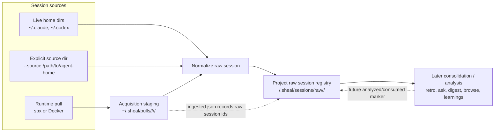

# T3. Normalize pulled sessions into a raw session registry

## Objective
Add a normalization layer between acquisition and analysis. Sheal should be able
to read agent sessions from live home directories, an explicitly supplied source
directory, or pulled sandbox/container staging, then write a sheal-owned raw
session record before any consolidation, retro, ask, digest, browse, or learning
generation consumes it.

## What we need to extract / do

### Pipeline schema



Acquisition only copies reachable evidence. Normalization creates the sheal-owned
raw session record. Later consolidation/analyze commands consume the raw registry
and are out of scope for this task.

### Raw registry layout

```text
<projectRoot>/.sheal/sessions/raw/<stable-session-id>/
  manifest.json
  transcript.raw.jsonl
  normalized.json
  git.diff
  provenance.json
```

`transcript.raw.jsonl`, `git.diff`, and `provenance.json` are present only when
the source provides them. `normalized.json` is the durable, tool-readable
`@liwala/agent-sessions` checkpoint representation.

### `manifest.json` shape

```json
{
  "schemaVersion": 1,
  "stableSessionId": "claude:7eb5a0b7-660c-4560-9a17-eba2843135dc",
  "nativeSessionId": "7eb5a0b7-660c-4560-9a17-eba2843135dc",
  "agent": "Claude Code",
  "projectPath": "/Users/lu/code/small-projects/agent-operating-policy",
  "createdAt": "2026-06-11T09:31:34.548Z",
  "updatedAt": "2026-06-11T09:31:34.548Z",
  "source": {
    "kind": "pull",
    "backend": "sbx",
    "name": "claude-agent-operating-policy",
    "pullDir": "~/.sheal/pulls/sbx/claude-agent-operating-policy/2026-06-11T09-47-18-759Z",
    "transcriptPath": "transcript/.claude/projects/-Users-lu-code-small-projects-agent-operating-policy/7eb5a0b7-660c-4560-9a17-eba2843135dc.jsonl"
  },
  "hashes": {
    "transcriptRawSha256": "hex",
    "normalizedSha256": "hex",
    "gitDiffSha256": "hex"
  },
  "provenance": {
    "sourcePaths": [],
    "gaps": []
  }
}
```

### Pull ingestion marker

```json
{
  "schemaVersion": 1,
  "ingestedAt": "2026-06-11T09:50:00.000Z",
  "rawSessionIds": [
    "claude:7eb5a0b7-660c-4560-9a17-eba2843135dc"
  ]
}
```

The ingestion marker means only "this pull was normalized into the raw registry."
It does not mean the session was analyzed, reviewed, consolidated, or used to
produce learnings.

### Capture hygiene rule

Normalization must preserve transcripts, diffs, and provenance, but ignore
secret-like artifact files by default. Examples include credentials files,
auth/token caches, session environment dumps, backups of agent config files, and
paste/cache directories. Any future artifact ingestion must use an explicit
allowlist.

### Storage decision

**Answered (2026-06-11, Luisa):** pull acquisition staging is global under
`~/.sheal/pulls/<backend>/<name>/<timestamp>/`. Normalized raw sessions are
project-local under `<projectRoot>/.sheal/sessions/raw/<stable-session-id>/`.
The existing `pull.stagingDir` setting remains the override for non-default pull
staging roots.

1. **Define the raw session registry contract** under
   `<projectRoot>/.sheal/sessions/raw/<stable-session-id>/`:
   - `manifest.json` with stable session identity, source path(s), source kind,
     agent, project/workspace, timestamps, content hashes, and provenance.
   - `transcript.raw.jsonl` preserving the original transcript bytes when a raw
     transcript exists.
   - `normalized.json` using the existing `@liwala/agent-sessions`
     `Checkpoint` / `Session` / `SessionEntry` shape.
   - `git.diff` and `provenance.json` copied or referenced from pull staging when
     available.
2. **Refactor agent session readers** so Claude and Codex parsing can run from:
   - the user's normal home directories (`~/.claude`, `~/.codex`);
   - an explicit source root supplied by sheal;
   - pulled staging paths such as
     `~/.sheal/pulls/<backend>/<name>/<timestamp>/transcript/...`.
3. **Normalize pulled sessions** from `~/.sheal/pulls/` into the project-local
   raw registry without requiring the original sandbox/container to still exist.
4. **Derive stable session IDs** from the transcript's native session id when
   available; otherwise use a deterministic fallback fingerprint over agent,
   project/workspace, transcript content hash, and capture provenance. Repeated
   pulls of the same transcript should resolve to the same raw session record.
5. **Defer cross-source aliases to Q2/T6**: stable raw IDs solve local repeated
   pulls. Q2 later answered the remote/cloud alias contract; T6 tracks the
   alias-aware implementation needed when source IDs do not match local
   transcript IDs.
6. **Mark pull staging as ingested, not analyzed** after successful
   normalization, for example with an `ingested.json` marker pointing to the raw
   session IDs produced. This marker enables later retention/GC without implying
   that retros or learnings have already been generated.
7. **Add capture hygiene to the pipeline**: normalization must ignore secret-like
   files from pulled artifacts such as `.credentials.json`, token/cache files,
   auth caches, and broad agent config backups unless explicitly allowlisted.
8. **Keep consolidation/analyze separate**: this task creates normalized raw
   records only; wiring `retro`, `ask`, `digest`, `browse`, and learning
   generation to the raw registry is follow-up work.

## Done when

- End-to-end tests show a pulled Claude transcript under
  `~/.sheal/pulls/<backend>/<name>/<timestamp>/transcript/.claude/projects/<slug>/*.jsonl`
  is normalized into `<projectRoot>/.sheal/sessions/raw/<stable-session-id>/`.
- End-to-end tests show a pulled Codex transcript under
  `~/.sheal/pulls/<backend>/<name>/<timestamp>/transcript/.codex/sessions/` is
  normalized into the same project-local raw registry shape.
- Re-normalizing repeated pulls of the same transcript updates or reuses the
  same raw session record rather than creating duplicate independent evidence.
- The raw session manifest records pull provenance and source paths.
- Secret-like artifact files are ignored by normalization and do not appear in
  the raw session record.
- A successful normalization writes an ingestion marker back to the pull staging
  directory without marking the session analyzed/consolidated.
- Existing live-home Claude and Codex session readers remain green.

## Output

Code and tests for the raw session registry, arbitrary-root Claude/Codex readers,
and pull-staging normalization. Expected touch points include
`packages/agent-sessions/src/*`, new normalization code under `src/`, CLI/docs
entry points, and focused tests.

## Dependencies

Requires the shipped `sheal pull` acquisition path and the full capture set.
Relates to Q2 for dedup identity and Q4 for retention/GC signalling.
